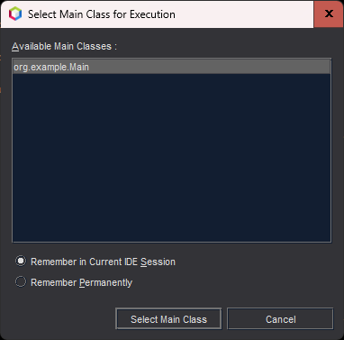

# TrabPetDogui

## Participantes:

| Nome              |     R.A. |
|-------------------|---------:|
| Guilherme Antunes | 250970-1 |
| Kenji Sousa       | 255114-1 |
| Leandro Damasceno | 224973-1 |
| Rafael Miranda    | 252248-1 |
| Willian Fedel     | 249931-1 |

## Importante:
O projeto foi criado com o IntelliJ IDEA.  
Caso seja aberto em uma IDE como o NetBeans, será necessário configurar a classe principal a ser executada.  
Isso já é feito automaticamente pelo NetBeans ao executar o projeto  

